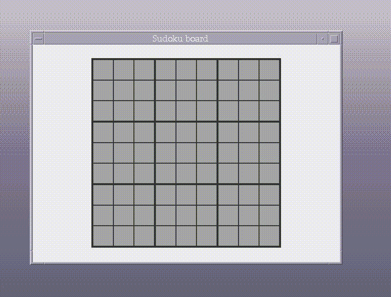

An elementary experiment on painting and mouse controls for a composite 2D object. Anything I learn in this is meant to help in implementing [Congkopi](https://github.com/keianrao/Congkopi).

Code has no license so is proprietary, but go ahead and copy from it.. I advise against using it for reference, the code is of poor quality.

